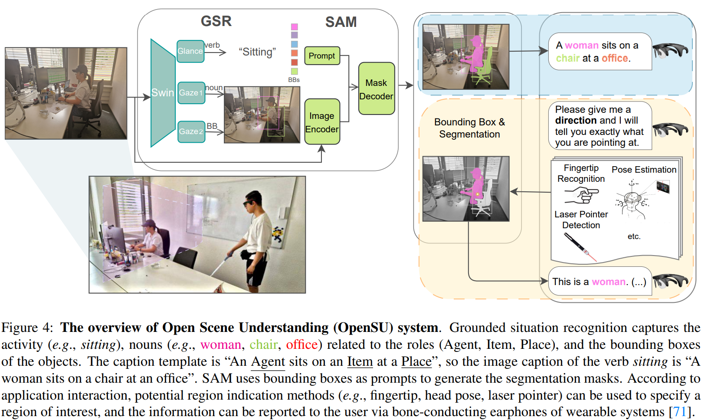

# Open Scene Understanding
Grounded Situation Recognition Meets Segment Anything for Helping People with Visual Impairments

## Environment
```
# Clone this repository and navigate into the repository
git clone https://github.com/RuipingL/OpenSU.git    
cd OpenSU                                          

# Create a conda environment, activate the environment and install PyTorch via conda
conda create --name OpenSU python=3.9              
conda activate OpenSU                             
conda install pytorch==1.8.0 torchvision==0.9.0 cudatoolkit=11.1 -c pytorch -c conda-forge 

# Install requirements via pip
pip install -r requirements.txt

# Install Segment Anything
pip install git+https://github.com/facebookresearch/segment-anything.git
```
## Model Checkpoints
download 
[Swin-T](https://github.com/SwinTransformer/storage/releases/download/v1.0.0/swin_tiny_patch4_window7_224.pth) to folder 'ckpt/Swin'
[Segment Anything](https://dl.fbaipublicfiles.com/segment_anything/sam_vit_h_4b8939.pth) and [MobileSAM](https://github.com/ChaoningZhang/MobileSAM/blob/master/weights/mobile_sam.pt) to folder 'ckpt/sam'
## Training 
```
CUDA_VISIBLE_DEVICES=0,1,2,3 python -m torch.distributed.launch --nproc_per_node=4 --use_env main.py   --batch_size 4 --dataset_file swig --epochs 40 --num_workers 4 --num_glance_enc_layers 3 --num_gaze_s1_dec_layers 3 --num_gaze_s1_enc_layers 3 --num_gaze_s2_dec_layers 3 --dropout 0.15 --hidden_dim 512 --output_dir OpenSU
```
## Evaluation
```
python main.py --saved_model ckpt/OpenSU_Swin.pth --output_dir CoFormer --dev
python main.py --saved_model ckpt/OpenSU_Swin.pth --output_dir CoFormer --test
```
## Demo
```
python demo.py --image_path img/carting_214.jpg --sam sam
python demo.py --image_path img/carting_214.jpg --sam mobilesam
```
